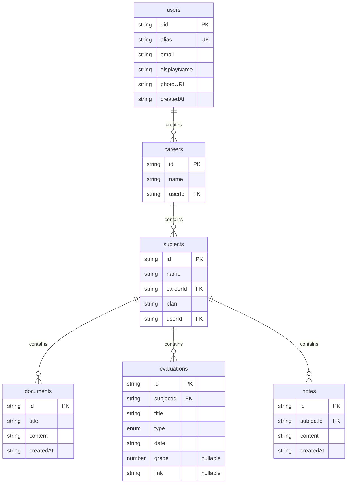

# Esquema de base de datos

Actualmente los datos se almacenan en [Firebase](./firebase.md).

## Colecciones

### `users`

- `uid`: string (PK, = Firebase Auth UID)
- `alias`: string (único)
- `email`: string
- `displayName`: string
- `photoURL`: string
- `createdAt`: string (ISO 8601)

Tipo: `src/types/user.ts` → `AppUser { uid, alias, email, displayName, photoURL, createdAt }`

### `careers`

- `name`: string
- `userId`: string (ref. a Firebase Auth)

Tipo: `src/types/career.ts` → `Career { id, name, userId }`

### `subjects`

- `name`: string
- `careerId`: string (ref. `careers/{id}`)
- `plan`: string
- `userId`: string

Tipo: `src/types/subject.ts` → `Subject { id, name, careerId, plan, userId }`

#### `documents`

`subjects/{subjectId}/documents`

- `title`: string
- `content`: string (Markdown)
- `createdAt`: string ("YYYY-MM-DD")

Tipo: `src/types/document.ts` → `Document { id, title, content, createdAt }`

#### `evaluations`

`subjects/{subjectId}/evaluations`

- `subjectId`: string (denormalizado)
- `title`: string
- `type`: `"partial" | "final" | "retake" | "practical_work" | "presentation"`
- `date`: string ("YYYY-MM-DD")
- `grade`: number | null
- `link`: string (URL opcional)

Tipo: `src/types/evaluation.ts` → `Evaluation { id, subjectId, title, type, date, grade, link }`

#### `notes` - `subjects/{subjectId}/notes`

- `subjectId`: string (denormalizado)
- `content`: string (texto plano, máx 200 chars)
- `createdAt`: string (ISO 8601)

Tipo: `src/types/note.ts` → `Note { id, subjectId, content, createdAt }`

---

## Diagrama entidad-relación

